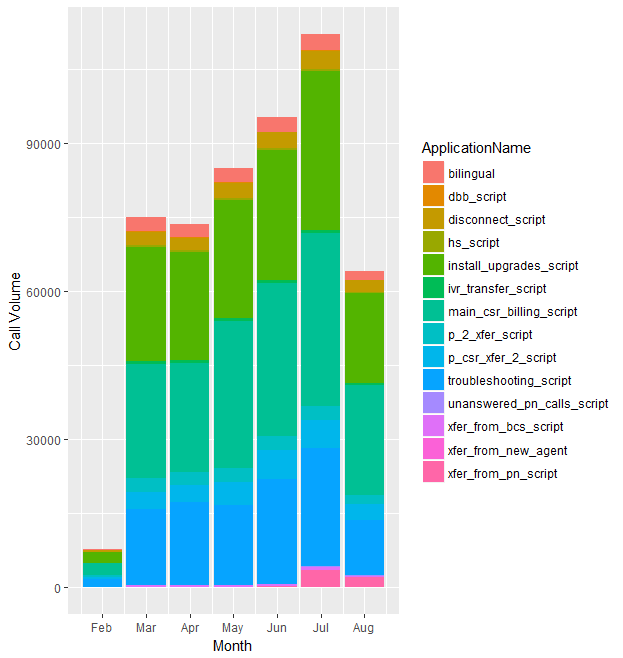
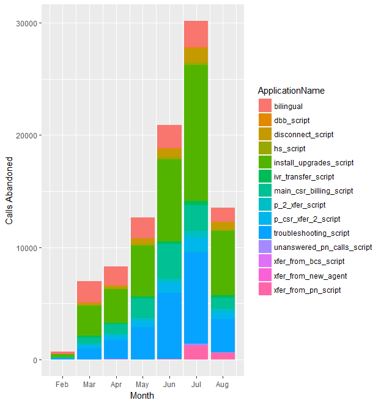
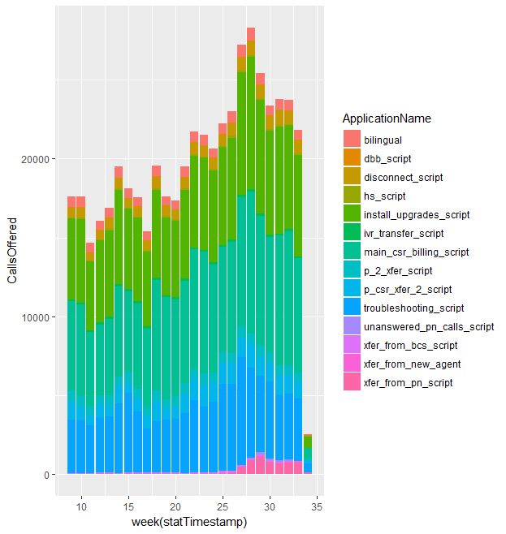
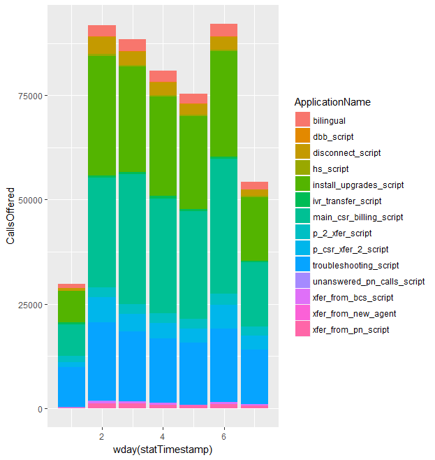
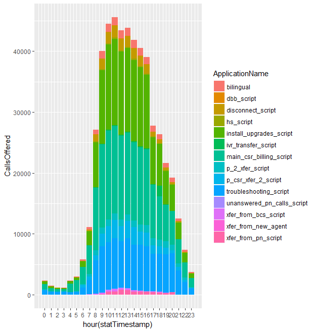
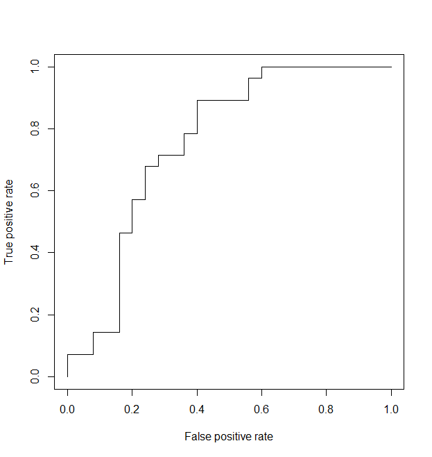

```{r setup, include=FALSE}
knitr::opts_chunk$set(echo = TRUE)
```

## Introduction

Call centers are an integral part of many businesses. The Customer Service Representatives (CSRs) are usually the first line of defense when troubleshooting, the gateway to sales, and a representation of the company when speaking with customers. A customer may want to speak with representatives for a number of reasons. These could be calling a bank to check account status, contacting an online company to follow up on a shipment, or even calling a university to get information on the courses and degrees offered. At the end of the day, many people have a need to speak with a human being who can assist the customer with their request.

Due to the numerous reasons why someone would contact a call center, a large problem exists: How many people are going to contact the call center, and does the call center have enough people answering the phones to address those callers? This project will look at the data for a call center who was experiencing long hold times for customers and a high abandonment rate (when the caller hangs up before ever getting to speak with a CSR). We will examine the data and try to determine a staffing level that would meet demands of increasing call volume. We will look at call volume by different periods of time, and ultimately determine how many CSRs are required to answer calls in order to meet the incoming call volume. 

## The Data
For this project, I have access to five datasets:

1. applications_sanitized.csv
2. skillsets_sanitized.csv
3. ptdAgents_sanitized.csv
4. answered_sanitized.csv
5. agent_perf_sanitized.csv

These datasets are from the phone system used by the client. Think about when you call a company - the first thing you usually are presented with is a menu. From that menu, you have multiple options (key presses) to help direct your call. For example, the menu might say "Press 1 for Customer Service, Press 2 for Billing, or Press 3 for Sales". After you make your selection, your call is processed by an application. This application can have logic built into it on how to handle your call. This determines things like whether music should play while you wait, if any announcements are to be made while you wait, and ultimately where your call should go. The destination is a skillset. Often skillsets are broken down by category which is a generic reason for your call. If you pressed 1 for Customer Service, there is a skillset that matches Customer Service requests. Each skillset has a number of CSRs assigned to it, and those are the CSRs who are eligible to handle your call. 

In the first file, applications_sanitized.csv, it contains data collected once a call is given to an application, but before it is given to a skillset. This file contains 28 fields of information including CallsOffered (how many calls were made to the call center that the application handled). Many of the fields will be ignored for our purposes, as things like IVRTerminated or CallsGivenForceDisconnect are not relevant to our problem. We're really interested in volume, calls answered (a CSR was successfullly connected to a caller), and perhaps ApplicationName since it gives some insight into why someone is calling (assuming the caller chose the correct option in the phone menu which we know is not always the case).

The next file, skillsets_sanitized.csv, contains much of the same type of information as the application file, except its data collection begins when the application hands the call to the skillset. In this set, our biggest focus is on CallsAnswered, as that indicates the process completed and connected a caller to a CSR.

The ptdAgents_sanitized.csv contains information about a subset of CSRs that are contracted by the client to augment their local staff. The extension of these CSRs is what's needed to identify them in the other datasets.

In our answered_sanitized.csv file, we have extensions of CSRs (both local and contracted), the supervisor they report to, and information about the call after it was answered like HandlingTime (the total time from the CSR and caller connecting until one part hangs up). This will be our main focus in this dataset.

Lastly, we have agent_perf_sanitized.csv. This also contains information after the call is connected to a CSR, but it focuses on the CSR's individual data points, rather than individual calls. This includes TalkTime, which shows the CSR's total time spent connected to a caller.

### What We Won't Find
Given the data in these datasets, there are some things we will not be able to determine. An important factor to the business would be why the caller is contacting the call center. While the ApplicationName can give some insight into this, it is not the best way to determine the reason for calling. Callers do not always choose the appropriate or best option in a phone menu. This could be because the caller is unsure which group can address their request or because they were impatient and pressed the first option presented to them. It can also be due to a lack of understanding of what's happening behind the scenes. For example, a caller might contact a call center because their service has stopped working. The option they chose on the menu was Troubleshooting. This would indicate there is a problem with their service. However, the reason the service stopped working was because the caller forgot to pay their bill. So the call was really to address a billing issue, and if we based everything off the application they selected, it would get labeled as a Troubleshooting issue. That's why this field could help give some insight, but should not be depended upon to determine the reason the call was placed.

For the purposes of this project, we are also addressing call volume as a whole, and will not be breaking it down by application or day/time of the call. While this can be useful information, we are just looking at our initial discovery. Further work can be done to break out staffing levels per hour or per application at a later time if the client would like to investigate.

## Data Wrangling
Once the datasets were imported, we filtered out the data that pertains to the primary applications the client indicated. There are a number of applications that are not directly connected to the phone menu which are used for internal purposes. The client wants to focus on incoming call volume, so the internal applications become irrelevant to our problem. 

```{r eval=FALSE}
# Grab the primary applications

apps_primary <- apps[ApplicationName %in% c("xfer_from_bcs_script", "bilingual", "p_2_xfer_script", 
                                            "p_csr_xfer_2_script","ivr_transfer_script","xfer_from_new_agent", 
                                            "disconnect_script", "dbb_script", "hs_script", 
                                            "install_upgrades_script", "main_csr_billing_script", 
                                            "troubleshooting_script", "unanswered_pn_calls_script", 
                                            "xfer_from_pn_script")]
skills_primary <- skills[SkillsetName %in% c("bcs_xfer", "bilingual", "xfer_from_ivr", "xfer_from_pn", 
                                             "unanswered_pn_calls", "xfer_from_new_agent", "p_csr_xfer_2_brc", 
                                             "p_2_xfer", "disconnect", "dbb", "hs", "main_csr_billing", 
                                             "troubleshooting", "install_upgrades")]
setDT(answered)
answered_primary <- answered[ApplicationName %in% c("xfer_from_bcs_script", "bilingual", "p_2_xfer_script", 
                                                    "p_csr_xfer_2_script", "ivr_transfer_script", 
                                                    "xfer_from_new_agent", "disconnect_script", "dbb_script", 
                                                    "hs_script", "install_upgrades_script", 
                                                    "main_csr_billing_script", "troubleshooting_script", 
                                                    "unanswered_pn_calls_script", "xfer_from_pn_script") 
                             | SkillsetName %in% c("bcs_xfer", "bilingual", "xfer_from_ivr", "xfer_from_pn", 
                                                   "unanswered_pn_calls", "xfer_from_new_agent", 
                                                   "p_csr_xfer_2_brc", "p_2_xfer", "disconnect", "dbb", "hs", 
                                                   "main_csr_billing", "troubleshooting", "install_upgrades")]
```


Next, we cleaned up the data by eliminating any incomplete records with missing data, removed some fields that won't be utilized, and renamed a few fields to be easier to work with and understand. 

```{r eval=FALSE}
# Missing data
agents_ptd <- agents_ptd[rowSums(is.na(agents_ptd)) != ncol(agents_ptd),]
agents_ptd <- agents_ptd %>% 
  filter(!(is.na(Ext)))

# Rename columns, drop some columns
colnames(agents_ptd)[colnames(agents_ptd) == "Ext"] <- "AgentID"
answered_primary <- answered_primary %>% mutate(CCMID = NULL, ProviderContactID = NULL, Originator = NULL, 
                                                RoutePoint = NULL, ApplicationStartStamp = NULL, 
                                                LastTreatmentID = NULL, LastTreatmentStamp = NULL, 
                                                LastTreatmentTime = NULL, SkillsetQueuedStamp = NULL, 
                                                InitialDisposition = NULL, ServiceStamp = NULL, 
                                                NumberOfTimesOnHold = NULL, NumberOfTimesRTQ = NULL, 
                                                FinalDisposition = NULL, FinalDispositionStamp = NULL, 
                                                NextSegmentID = NULL, ContactOriginatedStamp = NULL, 
                                                DisconnectSource = NULL, AgentName = NULL, 
                                                SupervisorName = NULL, SupervisorID = NULL)
answered_primary <- na.omit(answered_primary, c("AgentID"))
```


Next, the timestamps in the datasets were transformed to a format that makes them easier to utilize in R. During the data import, some of the fields were imported as characters so they needed to be changed to numeric fields. 

```{r eval=FALSE}
setDT(apps_primary)
apps_primary$statTimestamp <- ymd_hms(apps_primary$statTimestamp)
setDT(skills_primary)
skills_primary$statTimestamp <- ymd_hms(skills_primary$statTimestamp)
setDT(answered_primary)
answered_primary$OriginatedStamp <- ymd_hms(answered_primary$OriginatedStamp)
apps$statTimestamp <- ymd_hms(apps$statTimestamp)
aperf$statTimestamp <- ymd_hms(aperf$statTimestamp)
apps_primary[ , 2:25 :=lapply(.SD, as.numeric), .SDcols = 2:25]
skills_primary[ , 2:26 :=lapply(.SD, as.numeric), .SDcols = 2:26]
answered_primary <- answered_primary[,c(6, 1:5, 7:11)]
```


The datasets had some partial data from 2015 and also December 2016 that was removed since we wanted to examine the call volume in 2017. Finally, each dataset was accumulated over different periods of time in 2017. That meant we needed to make sure we compared apples to apples, and only kept the data from time periods shared among all datasets. 

```{r eval=FALSE}
apps_primary <- apps_primary[year(statTimestamp) != 2015]
skills_primary <- skills_primary[year(statTimestamp) != 2015]
apps_primary <- apps_primary[month(statTimestamp) != 12]
skills_primary <- skills_primary[month(statTimestamp) != 12]
apps_primary <- apps_primary %>% 
  filter(statTimestamp >= "2017-02-26" & statTimestamp <= "2017-08-20")
aperf <- aperf %>% 
  filter(statTimestamp >= "2017-02-26" & statTimestamp <= "2017-08-20")
skills_primary <- skills_primary %>% 
  filter(statTimestamp >= "2017-02-26" & statTimestamp <= "2017-08-20")
answered_primary <- answered_primary %>% 
  filter(OriginatedStamp >= "2017-02-26" & OriginatedStamp <= "2017-08-20" & HandlingTime > 0)
```

We'll want to remove the remaining columns that will not be used.

```{r eval=FALSE}
apps_primary <- apps_primary %>% 
  select(statTimestamp, ApplicationID, CallsAnswered, CallsOffered, TalkTime, ApplicationName)
skills_primary <- skills_primary %>% 
  select(statTimestamp, SkillsetID, ApplicationID, CallsAnswered, CallsOffered, TalkTime, ApplicationName, 
         SkillsetName)
answered_primary <- answered_primary %>% 
  select(ApplicationID, SkillsetID, AgentID, OriginatedStamp, HandlingTime, ApplicationName,SkillsetName)
aperf <- aperf %>% 
  select(statTimestamp, TelsetLoginID, CallsAnswered, CallsOffered, TalkTime, NotReadyTime)
```

These datasets were then saved to local files so we wouldn't have to redo the data wrangling in the event we needed a fresh start.

```{r eval=FALSE}
write.csv(apps_primary, "apps_primary_refined.csv", row.names = FALSE)
write.csv(skills_primary, "skills_primary_refined.csv", row.names = FALSE)
write.csv(agents_ptd, "agents_ptd_refined.csv", row.names = FALSE)
write.csv(answered_primary, "answered_primary_refined.csv", row.names = FALSE)
write.csv(aperf, "agent_perf_refined.csv", row.names = FALSE)
```


## Exploratory Analysis
Now that our data is cleaned up, we can begin our exploratory analysis. The first part was looking at the call volume by month, separated into groups based on application. 



The data for February was only for the last few days of the month, so we were expecting a small volume. However, July had an influx of calls. Unfortunately, I do not have access to the information as to why it spiked, but the client does recall a number of staffing issues for that month as well as a few service outages. The outages would have increased call volume, and staffing issues could result in people hanging up and calling back again which would also result in a higher call volume. Because we could not explain it, we left the data as-is rather than normalizing it. We also see a breakdown of which applications were used to process calls. The two largest applications were install_upgrades_script and main_csr_billing_script, indicating that the majority of calls were likely related to new services, potentially sales, and billing related questions.

Next we wanted to look at the number of calls abandoned. This is an important statistic in call centers because it shows how many people called and hung up the phone before being connected to a CSR. We already knew we had an issue with hold times, and that is a common factor in abandonment rate. 



We do see a different pattern emerge here than when looking at the calls offered. The obvious spike is in July when the client confirmed multiple issues had occurred. However, if we look at March through June, we see an increase in abandonment that isn't in the same proportion as the calls offered. Since long hold times are the most common reason for abandonment, this could indicate that a staffing issue began to exist in April, and was not addressed. With an increasing call volume and decreasing staff, less calls can be answered during a work day which leads to higher abandonment. We also notice that the two main applications for calls offered are the two biggest applications for calls abandoned. That would make sense as those applications receive a higher number of calls but it also means the client is not answering a large number of calls related to new services, sales, and billing. Those categories are calls we want to answer as they grow the company and make sure services are being paid. 

So far we've viewed the calls on a monthly basis, but what about weekly?



On a week to week basis, the call volume goes up and down, but on average remains about the same until we get to week 23 where the volume begins to increase slightly. This is in June where there are a number of seasonal customers. The increase here is likely explained by customers wanting services for the summer. However, let us look at weeks 27, 28, and 29. Those are the first three weeks in July where the volume spikes. This is consistent with what the client had explained. After some of the outage issues were resolved, the volume had gone back to a normal seasonal level.

Our next view was to look at the calls offered by day of the week. We know that call volume drops on the weekend, but by how much?



Here we can see that volume on Sundays is the lowest it will be all week, follow by Saturday. However, Saturdays get almost double the volume of Sundays. This is useful information because should the client want to dive deeper into this staffing problem, we can already guess that the client will need a larger staff available on Saturdays than Sundays. And through March to August, the volume on days during the work week are significantly higher than a given day on the weekend. 

Lastly, we'll look at the calls offered by hour. 



Here we see a large spike in volume starting around 8am and lasting until around 9pm. This is what we'd expect since those are the hours where most people are awake and wanting to deal with their issues or questions. Mid-day is our peak times and could likely be due to common lunch hours among callers. Again, our main applications being utilized are still install_upgrades_script and main_csr_billing_script.

## Recommended Analysis
The nature of this call center problem is not a new one. It has existed since the first telephone was available to receive calls. We will be using what's known as the Erlang-C formula to determine an appropriate staffing level based on the call volume. For this project, we'll be looking at the volume on a daily basis and coming up with a staffing level that covers the span of a day. Deeper analysis can be an option in the future to determine staffing levels every 15 minutes, in hour intervals.

The Erlang-C formula looks like this:

$$E_c(m,u) = \frac{\frac{u^m}{m!}}{\frac{u^m}{m!}+(1-p)\sum_{k=0}^{m-1} \frac{u^k}{k!}}$$
The first thing that's needed is to limit the volume to the main operational hours of the call center, which is 8am-6pm. However, the outsourced call center is not 100% dedicated to answering calls for the client meaning they can take calls that aren't for the client during the day. So we will subtract the calls offered to those agents from our total volume. There is a second outsourced call center that also is removed from our count here. Then we calculate our arrival rate which is measured in calls per second. 

```{r eval=FALSE}
# Calls for 8am - 6pm, get to calls per second
# Specify Arrival Rate A: X calls in 15 min/900 seconds
apps_primary_total <- apps_primary %>% 
  filter(hour(statTimestamp) >= 8 & hour(statTimestamp) <= 17) %>% 
  select(CallsOffered) %>% sum()

# Join calls answered, determine ptd calls from 8am-6pm
answered_primary_ptd <- inner_join(answered_primary, agents_ptd, by = "AgentID")
num_calls_ptd <- answered_primary_ptd %>% 
  filter(hour(OriginatedStamp) >= 8 & hour(OriginatedStamp) <= 17) %>% 
  nrow()

# Remove ptd calls from total offered. They are not 100% available for calls as they aren't dedicated employees
total_calls <- apps_primary_total - num_calls_ptd

# Find pn calls, remove them - they are a vendor. With no insight to their queue/agents/etc it's best to remove them 
# and only deal with calls the client is servicing
num_calls_pn <- apps %>% 
  filter(ApplicationName == "route_to_pn", hour(statTimestamp) >=8 & hour(statTimestamp) <= 17) %>% 
  select(CallsOffered) %>% 
  sum()
total_calls <- total_calls - num_calls_pn

# Arrival rate
total_days <- sum(days_in_month(c(3,4,5,6,7)))
calls_per_hour <- total_calls / (total_days * 10)
calls_per_quarter <- calls_per_hour / 4
arrival_rate <- calls_per_quarter / 900
```


After determining our arrival rate, we calculate the total handle time of the call. This includes hold time as well as talk time. Again, from this dataset we also will remove the outsourced call data. Now we can determine the duration of our calls. At this point, we can state how many agents are available to determine the Service Level we are providing. However, in this case we want to target an 80% Service Level, so we're going to inflate the number of agents available. Since the client is currently under 80% Service Level, we know the staffing level is too low so we increase the number of available agents to find out what Service Level would be obtained. The number of agents used is 37.

```{r eval=FALSE}
# Talk Time (includes hold time) + Not Ready Time, remove ptd talk time since those calls are discarded
# Specify duration Ts
talk_time_ptd <- answered_primary_ptd %>% 
  select(HandlingTime) %>% 
  sum()
talk_time <- skills_primary %>% 
  filter(hour(statTimestamp) >=8 & hour(statTimestamp) <= 17) %>% 
  select(TalkTime) %>% 
  sum()
total_talk_time <- talk_time - talk_time_ptd
not_ready <- aperf %>% 
  filter(hour(statTimestamp) >= 8 & hour(statTimestamp) <= 17) %>% 
  select(NotReadyTime) %>% 
  sum()
total_talk_time <- talk_time + not_ready

# Find calls answered, and remove ptd calls since those are discarded
calls_answered <- skills_primary %>% 
  filter(hour(statTimestamp) >=8 & hour(statTimestamp) <= 17) %>% 
  select(CallsAnswered) %>% 
  sum()
calls_answered <- calls_answered - num_calls_ptd

# Calculate the duraction of calls
duration <- total_talk_time/calls_answered

# Specify number of agents m: num agents
num_agents <- 37
```


The next part of the fomula is to calculate the Traffic Intensity, which is the arrival rate multiplied by the duration. Then we calculate Occupancy which is the Traffic Intensity divded by the number of available agents. Finally, we have all the variables in the formula and we just need to plug in the values and calculate it.

```{r eval=FALSE}
# Calculate traffic intensity u: u = A * Ts
traffic_intensity <- arrival_rate * duration

# Calculate agent occupancy p: p = u / m
agent_occupancy <- traffic_intensity / num_agents

# Erlang-C Ec(m, u) = (u^m/m!) / (u^m/m! + (1 - p) m-1{k=0 u^k/k!)
numerator <- traffic_intensity^num_agents/factorial(num_agents)
sigma <- 0
for (i in 0:(num_agents-1)){
  sigma <- sigma + traffic_intensity^i / factorial(i)
}
denominator <- numerator + ((1 - agent_occupancy) * sigma)
erlangC <- numerator/denominator
```


Now we have an Erlang value, we will take that and multiply it by 100 to get the probability that a caller will have to wait before being connected to an CSR. We then calculate the Average Speed to Answer. Next we define the target answer time, which in this case is 45 seconds. Using the above information, we can calculate the Service Level which is 80.35%. 

```{r eval=FALSE}
# Calculate probability of waiting Ec(m,u): Ec(m, u) * 100
wait_prob <- erlangC * 100

# Calculate average speed of answer Tw: Tw = (Ec(m, u) * T) / (m * (1 - p))
avg_speed_answer <- (erlangC * duration) / (num_agents * (1 - agent_occupancy))

# Calculate Seravice level:
#   t = target answer time
#   W(t) = Prob(waiting time <= t): = 1 * Ec(m, u) * e^(-(m-u) * t/Ts)
target_answer_time <- 45
exponent <- -(num_agents - traffic_intensity) * (target_answer_time / duration)
service_level <- 1 - erlangC * exp(exponent)
```

## Predict the Call Volume

We did perform logistic regression on that data I had to predict whether a day will have below or above average call volume. I did this as a proof of concept for the client. Showing how the process works and its accuracy will give confidence to explore the same evaluation on an hourly basis. The first step was loading the cleaned data from earlier, clean up the timestamps and a few columns.

```{r eval=FALSE}
# Get date into some workable formats
primaryApps$statTimestamp <- ymd_hms(primaryApps$statTimestamp)
primaryApps <- primaryApps %>% 
  mutate(Date = as.Date(statTimestamp), statTimestamp = NULL, ApplicationName = NULL, ApplicationID = NULL)
primaryApps <- aggregate(. ~ Date, primaryApps, FUN='sum')
```

Next we calculate the average calls per day from our data. Then we create a summarization of that data to work with, and add our classification variable "Volume". This will be used to indicate whether a day will be above average (1) or below average (0).

```{r eval=FALSE}
# Average calls per day
avgCallsPerDay <- sum(primaryApps$CallsOffered) / length(unique(paste(month(primaryApps$Date), 
                                                                      day(primaryApps$Date), sep = "/")))

# Create new df so that each observation is a daily total
primaryApps <- primaryApps %>% 
  group_by(Date) %>% 
  summarise(Sum = sum(CallsOffered))

# Add classification variable
primaryApps <- primaryApps %>% 
  mutate(Volume = ifelse(Sum > avgCallsPerDay, 1, 0))
primaryApps <- primaryApps %>% 
  mutate(Month=month(Date), Day=day(Date), WeekDay=wday(Date))
```

Our next step is to train our model with a portion of our data. We split the data into two groups, one for training and one for testing.

```{r eval=FALSE}
# Fit the model
set.seed(1979)
split <- sample.split(primaryApps$Volume, SplitRatio = 0.7)
train <- subset(primaryApps, split == TRUE)
test <- subset(primaryApps, split == FALSE)
primaryApps.mod <- glm(Volume ~ Month + Day + WeekDay, family=binomial, data=train)
summary(primaryApps.mod)
anova(primaryApps.mod, test="Chisq")
```

And finally, testing our model predictions with the leftover data in our test set.

```{r eval=FALSE}
# Assessing Predictability
primaryApps.pred <- predict(primaryApps.mod, newdata=test, type='response')
primaryApps.pred <- ifelse(primaryApps.pred > 0.5, 1, 0)
misClasificError <- mean(primaryApps.pred != test$Volume)
print(paste('Accuracy', 1-misClasificError))
```

Let's take a look at the true positive rate vs the false positive rate.

```{r eval=FALSE}
library(ROCR)
p <- predict(primaryApps.mod, newdata=test, type='response')
pr <- prediction(p, test$Volume)
prf <- performance(pr, measure="tpr", x.measure="fpr")
plot(prf)
auc <- performance(pr, measure="auc")
auc <- auc@y.values[[1]]
auc
primaryApps.sse <- sum((primaryApps.pred - test$Volume)^2)
primaryApps.sse
table(test$Volume, primaryApps.pred)
logisticAccuracy <- (17+20)/(17+20+8+8)
```



This gave us a 69.81% accuracy on predicting call volume. However, I thnk we can do better. This time, we will create a regression tree to do our predictions. Again, we split our data into training and testing datasets. Then, we create our tree and check its accuracy.

```{r eval=FALSE}
# Get the data into test and training sets
split <- sample.split(primaryApps$Volume, SplitRatio = 0.7)
primaryApps.train <- subset(primaryApps, split == TRUE)
primaryApps.test <- subset(primaryApps, split == FALSE)

# Create the tree
primaryApps.tree <- rpart(Volume ~ Month + Day + WeekDay, data = primaryApps.train, method="class")
prp(primaryApps.tree)

# PRedict on the test data and determine accuracy.
primaryApps.tree.pred <- predict(primaryApps.tree, newdata = primaryApps.test, type="class")
table(primaryApps.test$Volume, primaryApps.tree.pred)
treeAccuracy <- (17+23)/(17+23+8+5)
```


Our accuracy has increased to 75.47% - a nice improvement from before. But before we finish, we will apply the random forest method to see if there is still some room for improvement. Once more, we split our dataset into training and testing datasets. Then, we build the random forest, make predictions on our test data, and determine the accuracy.

```{r eval=FALSE}
# Get data into test and training
split <- sample.split(primaryApps$Volume, SplitRatio = 0.7)
primaryApps.train <- subset(primaryApps, split == TRUE)
primaryApps.test <- subset(primaryApps, split == FALSE)

# Build the random forest
primaryApps.train$Volume <- as.factor(primaryApps.train$Volume)
primaryApps.test$Volume <- as.factor(primaryApps.test$Volume)
primaryApps.forest <- randomForest(Volume ~ Month + Day + WeekDay, data = primaryApps.train, 
                                   nodesize = 25, ntree = 200)
primaryApps.forest.pred <- predict(primaryApps.forest, newdata = primaryApps.test)

# Determine accuracy
table(primaryApps.test$Volume, primaryApps.forest.pred)
forestAccuracy <- (14+28)/(14+28+11+0)
```

Once again, our accuracy has improved. We now have a 79.25% accuracy in predicting daily call volume. I believe the access to the individual call records and some additional information to explain peaks and valleys in the data that we could improve this accuracy further over time. 

## Conclusion

By using the Erlang-C formula, we have been able to determine that in order to meet the client's call volume needs, they will need to have 37 available CSRs throughout the day to answer all of the calls.

Again, this is only based on daily call volume. So the first thing I recommend is that the client compare their current number of available CSRs to the target of 37 and see how far off they are. We'll need to make sure that there's support for hiring additional CSRs. Then we can do a similar analysis on the data but look at the volume on a per hour basis. This way more shifts can be created and the number of available CSRs would more accuractely reflect the volume in that hour. We know that calls do not come in at a steady rate, so breaking it down on an hourly level would be beneficial.

## Future Steps

The datasets provided are of aggregated data in 15 minute intervals. This means the individual call records are not available at this time. If that data can be made available, we can look closely at CSR performance statistics. These statistics can indicate training areas for CSRs. For example, if a CSR frequently goes over the target handle time for calls, that can have a negative impact on how many calls are answered during the day. If a CSR frequently is in a Not Ready state, that will negatively impact the calls answered. These are things that can be done to make the current staff more efficient, and potentially eliminate the need for a few new positions.

We could also perform logistic regression on the dataset of individual calls to determine whether or not a caller will abandon the call or not. Then, we can monitor the calls in real time to see callers abandon the queues. While there's currently no way to address those calls (selectively answer them), seeing callers drop from queues in real time can be a visual motivator to resolve the issue and provide additional motivation for the approval of hiring more CSRs.